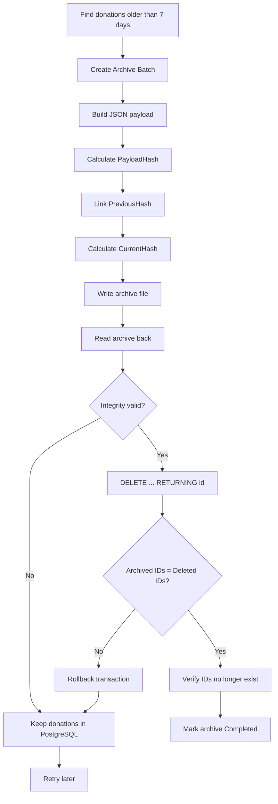
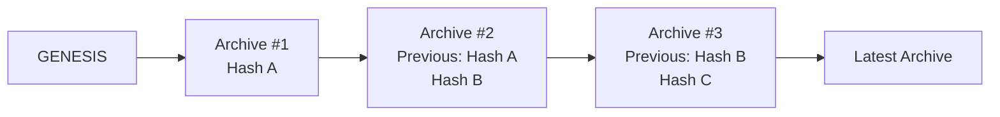

# Donation Archiving System

> A small .NET backend challenge turned into a verifiable archive pipeline inspired by **Git commits**.

## Overview

This project manages donation records using:

- **C# / .NET 10**
- **Dapper**
- **PostgreSQL / Supabase**
- **Local JSON archive storage** for the current test environment
- **SHA-256 integrity verification**
- A **Git-style archive hash chain**
- Transactional deletion using `DELETE ... RETURNING`
- Retry-safe archive processing

The original requirement is simple:

> Donations older than 7 days must be archived, and they must only be deleted from SQL after the archive has been stored successfully.

Instead of treating archiving as only a file-transfer problem, I treated each archive operation similarly to a **Git commit**.

---

## The Idea

Every archive batch represents one immutable historical step.

```text
GENESIS
   ↓
Archive #1
   ↓
Archive #2
   ↓
Archive #3
   ↓
Archive #4
```

Each archive stores:

- `ArchiveId`
- `SequenceNumber`
- `PreviousHash`
- `PayloadHash`
- `CurrentHash`
- `RecordCount`
- Donation records

The next archive references the hash of the previous archive.

This makes the archive history **tamper-evident**: if an older archive is modified or corrupted, recalculating the chain will expose the mismatch.

---

## Why I Designed It This Way

The real problem is not simply:

```text
SQL → File → Delete
```

The important question is:

> **When is it safe to transfer responsibility for the data from the active database to the archive?**

Before archiving:

```text
PostgreSQL = Source of Truth
```

After a successful archive:

```text
Archive Storage = Historical Source of Truth
```

For that reason, a successful file write is **not enough**.

The archive must be:

1. Written successfully.
2. Read back from storage.
3. Deserialized successfully.
4. Verified using hashes.
5. Verified against the exact expected donation IDs.
6. Only then may the database records be permanently deleted.

The `DELETE` operation is therefore treated as the **irreversible commit point**.

> **Technical success is not the same as business completion.**

---

## Archive Flow



---

## Git-Style Hash Chain



The current archive hash is derived from stable archive metadata and the payload hash, so archive integrity can be verified later.

---

## Current Storage Mode

The project is currently tested with a **local archive-storage simulation** because an AWS environment was not available during development.

Generated files are stored under:

```text
LocalArchive/
└── archives/
    └── donations/
        ├── <archive-id>.json
        └── ...
```

The storage flow still behaves like remote object storage:

```text
Write
  ↓
Read back
  ↓
Verify
  ↓
Delete SQL records
```

The business logic is intentionally separated from the storage location so the local implementation can later be replaced with an Amazon S3 implementation.

---

## Database

The project uses **PostgreSQL / Supabase** with **Dapper**.

Dapper is used for all database operations:

- `INSERT`
- `SELECT`
- `UPDATE`
- `DELETE`
- Transactions

No Entity Framework is used.

### Active Donations

The `donations` table contains only active records that have not completed the archive process.

### Archive History

Archive metadata is stored separately so the archive chain can be verified without keeping old donation data in the active table.

---

## Exact Deletion Verification

One important improvement in the implementation is that deletion is not validated only by row count.

A check such as:

```text
Archived count = 3
Deleted count  = 3
```

is not strong enough because the wrong three records could theoretically be deleted.

Instead PostgreSQL uses:

```sql
DELETE FROM donations
WHERE archive_batch_id = @ArchiveId
RETURNING id;
```

Then the application compares:

```text
Archived IDs = [3, 4, 5]
Deleted IDs  = [3, 4, 5]
```

Only an exact match is accepted.

The application then queries PostgreSQL again inside the transaction to confirm that those IDs no longer exist.

---

## Failure Safety

### Archive write failure

```text
Archive write fails
        ↓
No SQL DELETE
        ↓
Donations remain active
```

### Verification failure

```text
Archive created
      ↓
Verification fails
      ↓
No SQL DELETE
      ↓
Retry safely later
```

### Successful archive

```text
Archive written
      ↓
Read back
      ↓
Hashes verified
      ↓
IDs verified
      ↓
DELETE exact records
      ↓
Confirm records are gone
      ↓
Archive Completed
```

---

## Project Structure

```text
DonationArchiving/
│
├── Models/
│   ├── Donation.cs
│   └── ArchiveRecord.cs
│
├── Repositories/
│   └── DonationRepository.cs
│
├── Services/
│   └── ArchivingService.cs
│
├── Storage/
│   └── LocalArchiveStorage.cs
│
├── Database/
│   ├── schema.sql
│   └── seed.sql
│
├── LocalArchive/
│   └── archives/
│       └── donations/
│
├── Program.cs
└── DonationArchiving.csproj
```

---

## Application Menu

```text
==============================
 Donation Archiving System
==============================
1. Insert Donation
2. Import Donations
3. Display Donations
4. Run Archive
5. Verify Archive Chain
0. Exit
```

### 1 — Insert Donation

Adds one donation to PostgreSQL.

### 2 — Import Donations

Imports multiple donations safely.

### 3 — Display Donations

Shows all currently active donations.

### 4 — Run Archive

Runs the archive process manually.

### 5 — Verify Archive Chain

Reads completed archives and validates the Git-style hash chain.

---

## Running the Project

### Restore dependencies

```bash
dotnet restore
```

### Build

```bash
dotnet build
```

### Run interactive mode

```bash
dotnet run
```

### Run archiving directly

```bash
dotnet run -- archive
```

### Verify the archive chain

```bash
dotnet run -- verify
```

---

## Scheduling

The archive command is designed to be scheduler-friendly:

```bash
dotnet run -- archive
```

It can be triggered every five minutes using a Cron Job:

```cron
*/5 * * * *
```

or by another scheduler such as Windows Task Scheduler.

The scheduler is only the trigger.  
The archive safety, verification, retry, and deletion rules remain inside the application.

---

## Test Scenario

Example active data:

| ID | Username | Age |
|---:|---|---|
| 1 | Ahmad | Today |
| 2 | Omar | 3 days |
| 3 | Ali | 8 days |
| 4 | Sara | 15 days |
| 5 | Khaled | 20 days |

Expected archive result:

```text
Archived IDs: [3, 4, 5]
Deleted IDs:  [3, 4, 5]
Remaining SQL IDs: [1, 2]
```

The local JSON archive contains the removed records plus the archive-chain metadata.

---

## Verified End-to-End Behavior

The local implementation was tested with the following results:

- Build completed with **0 errors**.
- SQL initially contained IDs `[1,2,3,4,5]`.
- A simulated archive-write failure did **not** delete database records.
- A successful archive stored IDs `[3,4,5]`.
- `DELETE ... RETURNING` returned exactly `[3,4,5]`.
- A follow-up SQL query confirmed those records no longer existed.
- SQL retained only `[1,2]`.
- Archive-chain verification passed.

---

## Core Engineering Principles

This challenge touches several backend concepts at once:

`Dapper` · `Transactions` · `Archiving` · `Retention` · `Idempotency` · `Retry Safety` · `Integrity Verification` · `Failure Handling` · `Data Consistency` · `Hash Chains` · `Source of Truth`

The main idea behind the implementation is:

> **Do not delete the source record because storage returned success. Delete it only after proving that the exact historical data is safely stored and verifiable.**

---

## Future Improvement

The local storage implementation can later be replaced with Amazon S3 while keeping the same archive pipeline:

```text
PostgreSQL
    ↓
Archive Batch
    ↓
Hash + Verify
    ↓
Amazon S3
    ↓
Read Back + Verify
    ↓
Delete Exact SQL Records
```

---

## Author

**Izz Mansour**  
.NET Backend Engineer Trainee  
Computer Science — An-Najah National University
